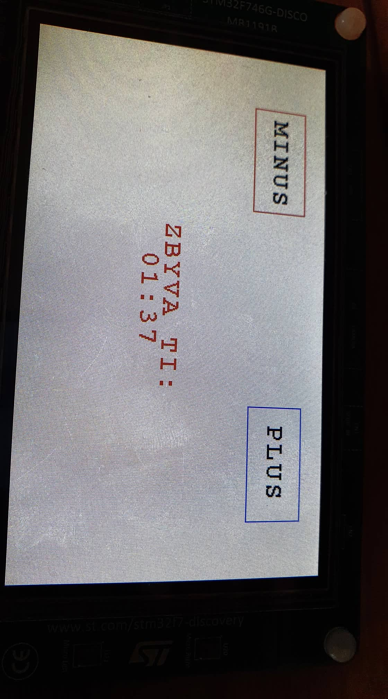

# timebomb

* nastaví počáteční čas na 2 minuty
* po vypršení času "exploduje"
* tlačítka plus, minus přidají/uberou po 1 vteřině
    * stisk se kontroluje každých 100ms
* za 5 vteřin od výbuchu se zařízení restartuje
    * nevyužívá watchdog, nenašel jsem potřebnou knihovnu (?)
